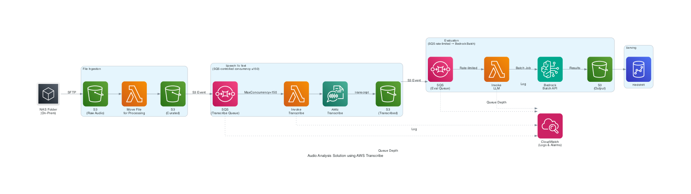

# Audio Analysis Solution using AWS Transcribe

## Overview
Recommended architecture for large-scale audio file analysis using AWS Transcribe for speech-to-text and Amazon Bedrock for LLM-based evaluation.

## Architecture Diagram



## Flow
```
NAS → S3 (raw) → Lambda → S3 (curated)
                              ↓ S3 Event
                         SQS [MaxConcurrency=150] → Lambda → Transcribe → S3 (transcribed)
                                                                               ↓ S3 Event
                                                              SQS [rate-limited] → Lambda → Bedrock Batch API
                                                                                                  ↓
                                                                                          S3 (output) → Redshift
```

## Generate Diagram
```bash
cd architectures/audio_analysis_transcribe
python audio_analysis_architecture.py
```

---

## Implementation Notes

### Issue 1: Transcribe Concurrency (150 job cap)

**Docs**: [Transcribe Quotas](https://docs.aws.amazon.com/transcribe/latest/dg/limits-guidelines.html) | [Lambda SQS Scaling](https://docs.aws.amazon.com/lambda/latest/dg/services-sqs-scaling.html)

- The 150 concurrent job limit is a soft quota — request an increase via Service Quotas console
- Replace EventBridge direct trigger with SQS → Lambda pattern; set `MaximumConcurrency` on the event source mapping to cap Lambda invocations at exactly 150 (matching Transcribe's limit)
- SQS naturally absorbs the burst — files queue up and drain at a controlled rate instead of all hitting Transcribe at once

```bash
aws lambda update-event-source-mapping \
  --uuid "<your-mapping-uuid>" \
  --scaling-config '{"MaximumConcurrency": 150}'
```

### Issue 2: Bedrock 20 hits/min Rate Limit (429 errors)

**Docs**: [Bedrock Scaling & Throughput Best Practices](https://docs.aws.amazon.com/bedrock/latest/userguide/scaling-throughput-best-practices.html)

- Request a quota increase via Service Quotas console (RPM is adjustable)
- Implement exponential backoff with jitter in the Lambda that calls Bedrock — boto3 supports this natively:

```python
from botocore.config import Config
config = Config(retries={"total_max_attempts": 6, "mode": "standard"})
client = boto3.client("bedrock-runtime", config=config)
```

- Use Cross-Region inference to spread load across regions if a single region is saturated
- For this batch/offline use case: switch to Bedrock Batch Inference API — submits all prompts asynchronously to S3, no per-minute rate limit concern → [Batch Inference docs](https://docs.aws.amazon.com/bedrock/latest/userguide/batch-inference.html)

### Issue 3: No Proper Queue (Excel as queue)

**Docs**: [Lambda with SQS](https://docs.aws.amazon.com/lambda/latest/dg/with-sqs.html) | [SQS Backpressure](https://docs.aws.amazon.com/lambda/latest/dg/troubleshooting-event-source-mapping.html)

- Replace Excel audit list with SQS Standard Queue between each pipeline stage
- SQS handles backpressure natively — if Bedrock is throttled, messages stay in queue with visibility timeout and retry automatically
- Add a Dead Letter Queue (DLQ) to capture failed evaluations without data loss
- Use SQS → Lambda event source mapping with `MaximumConcurrency` to control throughput into Bedrock precisely
