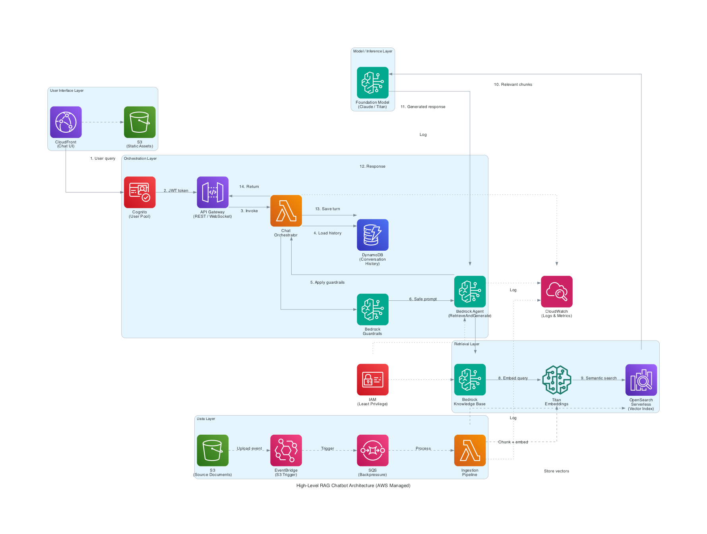

# High-Level RAG Chatbot Architecture (AWS Managed)



## Overview

This diagram shows a production-grade, fully managed RAG chatbot on AWS. It uses Amazon Bedrock's native `RetrieveAndGenerate` API rather than custom Lambda orchestration, reducing operational overhead and aligning with AWS best practices for GenAI workloads.

The architecture is organized into five layers, each with a clear responsibility boundary.

---

## Layers

### 1. User Interface Layer
- **CloudFront** — CDN serving the chat UI with low latency globally
- **S3 (Static Assets)** — hosts the frontend application (HTML/JS/CSS)

### 2. Orchestration Layer
- **Cognito (User Pool)** — authenticates users, issues JWT tokens; API Gateway validates the token before any backend call
- **API Gateway** — REST or WebSocket endpoint; WebSocket enables streaming responses
- **Chat Orchestrator (Lambda)** — thin coordinator: loads session history, calls Guardrails, invokes the Bedrock Agent, saves the conversation turn
- **Bedrock Guardrails** — content filtering applied to both input and output; blocks harmful, off-topic, or PII-containing content before it reaches the model
- **Bedrock Agent** — fully managed orchestrator that calls `RetrieveAndGenerate`, handles multi-turn context, and routes to the Knowledge Base
- **DynamoDB (Conversation History)** — persists session turns keyed by session ID for multi-turn coherence

### 3. Retrieval Layer
- **Bedrock Knowledge Base** — managed RAG pipeline; handles chunking, embedding, and retrieval without custom code
- **Titan Embeddings** — converts queries and document chunks into vector representations
- **OpenSearch Serverless (Vector Index)** — stores and searches embeddings using approximate nearest-neighbour (ANN) search

### 4. Model / Inference Layer
- **Foundation Model (Claude / Titan)** — generates the final response using the retrieved chunks as context; isolated layer makes it easy to swap models

### 5. Data Layer
- **S3 (Source Documents)** — stores raw documents (PDF, DOCX, TXT, etc.) that feed the knowledge base
- **EventBridge** — event-driven trigger on S3 `ObjectCreated` events; decouples storage from processing
- **SQS** — buffers ingestion events to handle backpressure during high document upload volume
- **Ingestion Pipeline (Lambda)** — chunks documents, generates embeddings via Titan, and stores vectors in OpenSearch

---

## Cross-Cutting Concerns

- **CloudWatch** — logs and metrics for Chat Lambda, Bedrock Agent, and Ingestion Lambda; key metrics: query latency, token usage, ingestion throughput, SQS queue depth
- **IAM (Least Privilege)** — scoped roles for each service; Bedrock Agent and Knowledge Base have separate execution roles with only the permissions they need

---

## Key Design Decisions

| Decision | Rationale |
|---|---|
| Bedrock Agent + Knowledge Base over custom Lambda RAG | Fully managed chunking, embedding, and retrieval; built-in session context management |
| Guardrails before Agent | Filters bad input before it consumes tokens or reaches the model |
| EventBridge over direct S3 → Lambda | Fan-out capability, filtering, and routing without code changes |
| SQS between EventBridge and Ingestion Lambda | Handles backpressure; decouples ingestion rate from Lambda concurrency |
| DynamoDB for session state | Low-latency key-value reads; TTL for automatic session expiry |
| OpenSearch Serverless | No cluster management; scales automatically with query and indexing load |

---

## Exam Relevance (Tier 0-1)

- `RetrieveAndGenerate` API — core Bedrock Knowledge Base invocation pattern
- Guardrails — content filtering, PII redaction, topic denial
- Bedrock Agent orchestration — multi-step reasoning, action groups
- Cognito + API Gateway authorizer — standard auth pattern for GenAI APIs
- EventBridge fan-out — preferred over direct S3 → Lambda for extensibility
- SQS for backpressure — decoupling ingestion from downstream processing
- DynamoDB for stateful multi-turn conversations

---

## Generate the Diagram

```bash
# From workspace root
source .venv/bin/activate
python aws-genai-professional-reference/architectures/rag_chatbot_highlevel.py
```
