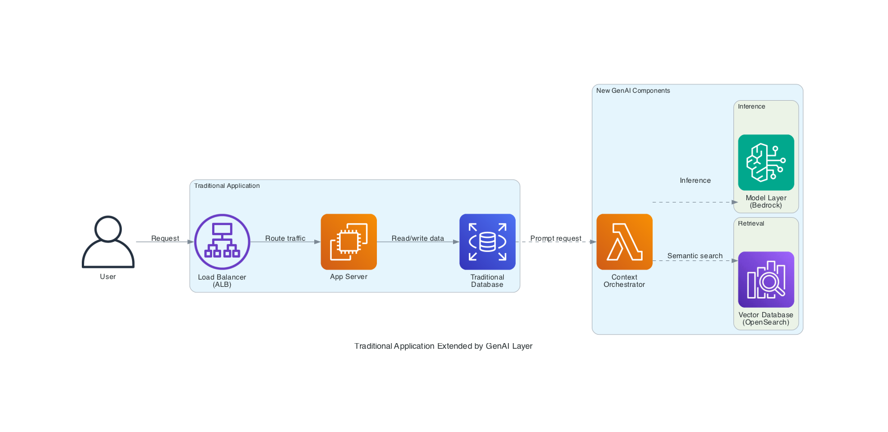

# Traditional Application Extended by GenAI Layer



## Overview

This diagram shows how a traditional 3-tier application can be extended with a GenAI layer without replacing the existing architecture.

- User traffic flows through a load balancer to the app server, which reads/writes structured data from a traditional database
- When AI-powered functionality is needed, the app server sends a prompt request to a context orchestrator
- The orchestrator performs semantic search on a vector database to retrieve relevant knowledge chunks
- Retrieved context is combined with the user prompt and sent to a foundation model for inference
- The generated response flows back through the app server to the user

---

## Components

| Component            | AWS Service | Role                                                                    |                                    |
| ----------------------| -------------| -------------------------------------------------------------------------| ------------------------------------|
| Load Balancer        | ALB         | Distributes incoming user traffic across app servers                    |                                    |
| App Server           | EC2         | Processes requests, reads/writes structured data, routes to GenAI layer |                                    |
| Traditional Database | RDS         | Stores structured application data                                      |                                    |
| Context Orchestrator | Lambda      | Coordinates retrieval and inference; prepares prompt with context       |                                    |
| Vector Database      | OpenSearch  | Semantic search over embedded knowledge chunks                          |                                    |
| Model Layer          |             |                                                                         | through the app server to the user |

---

## Generate the Diagram

```bash
# From workspace root
source .venv/bin/activate
python aws-genai-professional-reference/architectures/traditional_app_with_genai_layer/traditional_app_with_genai.py
```
